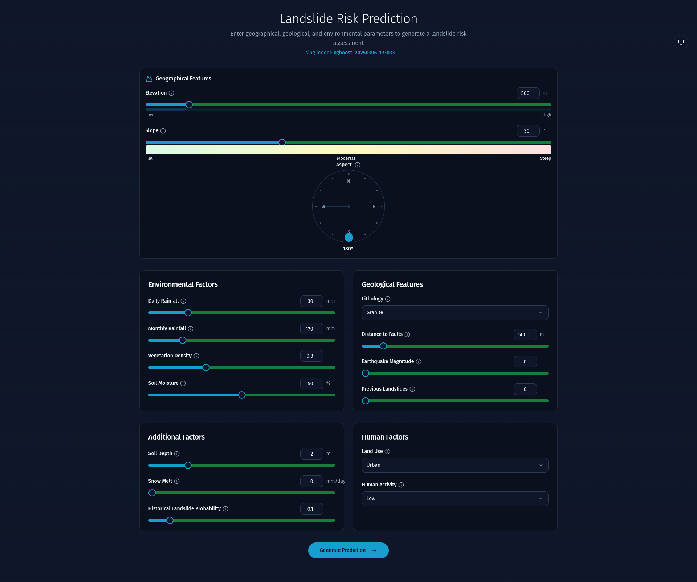
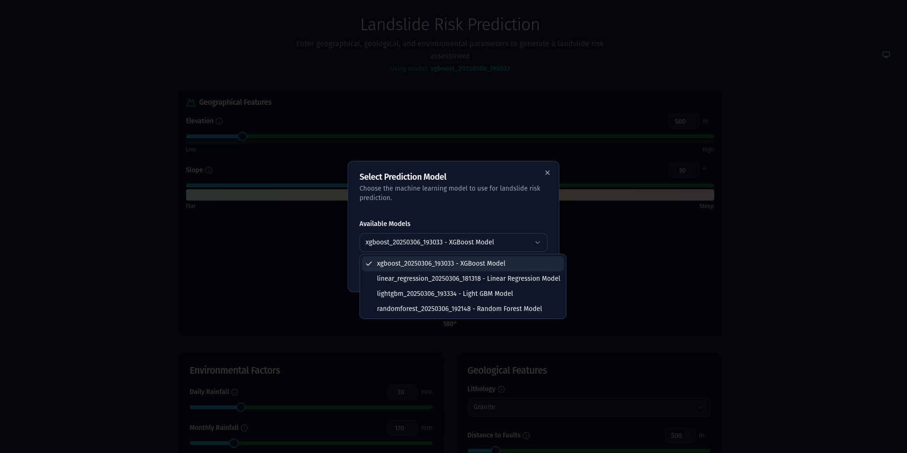
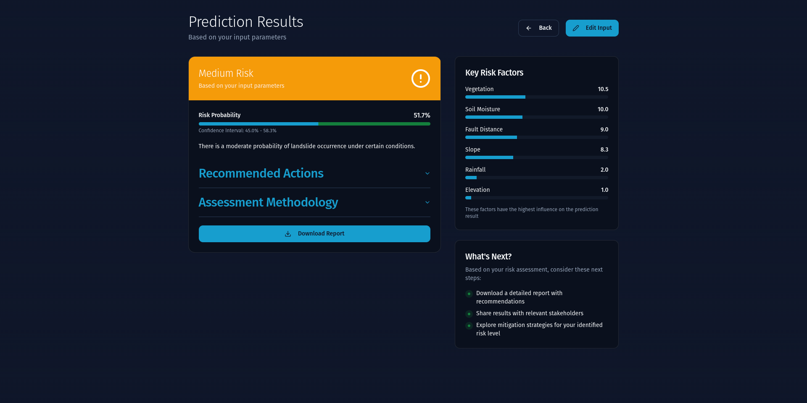

# Landslide Predictor: Solution for Landslide Risk Prediction


**Landslide Predictor** is a comprehensive machine learning project designed to predict landslide risks using synthetic data. This solution integrates exploratory data analysis (EDA), advanced machine learning models, a robust data preprocessing pipeline, a flexible training pipeline with optional hyperparameter tuning, a FastAPI-based prediction API, and plans for a Streamlit app for interactive deployment. By leveraging features such as terrain characteristics (e.g., elevation, slope), rainfall patterns, soil properties, and human activity, the project provides a scalable framework for landslide risk assessment.

## Features

- **Multiple Models**: Implements RandomForest, XGBoost, LightGBM, and Linear Regression for diverse predictive capabilities.
- **Data Pipeline**: Preprocesses synthetic data with feature engineering, scaling, and one-hot encoding.
- **Training Pipeline**: Supports model training with or without hyperparameter optimization using Optuna.
- **Evaluation Metrics**: Assesses model performance using MSE, R², and RMSE.
- **API**: Offers a FastAPI server for real-time predictions.
- **Testing**: Includes unit tests for reliability and robustness.
- **EDA**: Provides a Jupyter notebook for data exploration.
- **Frontend**: Interactive Vite.js application for user-friendly access to predictions.

## Table of Contents

- [Prerequisites](#prerequisites)
- [Installation](#installation)
- [Project Structure](#project-structure)
- [Models](#models)
- [Data Pipeline](#data-pipeline)
- [Training Pipeline](#training-pipeline)
- [Evaluation](#evaluation)
- [API](#api)
- [Usage](#usage)
- [Testing](#testing)
- [Frontend](#frontend)
- [Demo](#demo)
- [Contributing](#contributing)

## Prerequisites

- **Python**: 3.8 or higher
- **pip**: For installing Python packages
- **Node.js 14+**: For the frontend application
- **npm**: For managing JavaScript packages

## Installation

1. **Clone the Repository**:
```bash
git clone https://github.com/yourusername/LandslidePredictor--Solution-for-Landslide-Risk-Prediction.git
cd LandslidePredictor--Solution-for-Landslide-Risk-Prediction
```

2. **Install Backend Dependencies**:
Install the required packages listed in requirements.txt:
```bash
pip install -r requirements.txt
```

3. **Install Frontend Dependencies**:
Navigate to the frontend directory and install npm packages:
```bash
cd frontend
npm install
cd ..
```

## Project Structure

- **data/**: Synthetic landslide data (e.g., synthetic_landslide_data.csv).
- **src/**: Core source code.
  - **config/**: Model and logging configurations (model_config.py, logging_config.py).
  - **data/**: Data loading and preprocessing (data_loader.py, data_pipeline.py).
  - **models/**: Model definitions (random_forest.py, xgboost_model.py, etc.).
  - **optimize/**: Hyperparameter tuning with Optuna (tuner.py).
  - **train.py**: Training logic.
  - **evaluation.py**: Evaluation metrics.
- **api/**: FastAPI application for predictions.
  - **models/**: Pydantic schemas (schemas.py).
  - **services/**: Model serving logic (model_service.py).
  - **routers/**: API endpoints (predictions.py).
- **saved_models/**: Trained model files (e.g., xgboost_20250306_193033.pkl).
- **tests/**: Unit tests (test_model.py, test_utils.py, test_data.py).
- **frontend/**: Vite.js application for the user interface.
  - **src/**: Frontend source code.
  - **public/**: Static assets.
  - **package.json**: Frontend dependencies.
  - **vite.config.js**: Vite configuration.
- **run_pipeline.py**: Main script for training and evaluation.
- **server.py**: FastAPI server entry point.

## Training Pipeline

The training pipeline, managed by run_pipeline.py and src/train.py, allows flexible model training:

- **Script**: run_pipeline.py serves as the entry point.
- **Options**: Supports model selection and optional hyperparameter tuning.
- **Process**:
  - Loads and preprocesses data.
  - Trains the specified model using default parameters or optimized ones (via Optuna if --train is used).
  - Saves the trained model to saved_models/ with a timestamp (e.g., xgboost_20250306_193033.pkl).
  - Evaluates the model on the test set.

### Training Command

```bash
python run_pipeline.py --model <model_name> --train
```
- **--model**: Options are randomforest, xgboost, lightgbm, or linear_regression.
- **--train**: Enables hyperparameter tuning (optional; omit for default parameters).

### Example

```bash
python run_pipeline.py --model xgboost --train
```

### Help Output

Running `python run_pipeline.py --help` provides:

```
usage: run_pipeline.py [-h] [--model {randomforest,xgboost,lightgbm,linear_regression}] [--train]

Train a landslide prediction model

optional arguments:
  -h, --help            show this help message and exit
  --model {randomforest,xgboost,lightgbm,linear_regression}
                        Model to train
  --train               Enable with hyperparameter fine-tuning
```

## Evaluation

Post-training, models are evaluated in run_pipeline.py using metrics from src/evaluation.py:

- **Mean Squared Error (MSE)**: Average squared difference between predictions and actual values.
- **R² Score**: Proportion of variance explained by the model.
- **Root Mean Squared Error (RMSE)**: Square root of MSE, in the same units as the target.

Metrics are logged to the console and stored in logs/ for review.

## API

The FastAPI-based API, defined in server.py and api/, serves predictions:

### Running the API

```bash
uvicorn server:app --reload --host 0.0.0.0 --port 8000
```
- Access it at http://localhost:8000.
- View documentation at http://localhost:8000/docs.

### Endpoints

- **GET /api/v1/models**: Lists available models in saved_models/.
- **POST /api/v1/predict**: Returns a landslide risk prediction for given inputs.

## Usage

### API Prediction Example

Use curl to make a prediction:

```bash
curl -X POST "http://localhost:8000/api/v1/predict" -H "Content-Type: application/json" -d '{
    "model_name": "xgboost_20250306_193033",
    "elevation": 500,
    "slope": 30,
    "aspect": 180,
    "rainfall_daily": 30.0,
    "rainfall_monthly": 170.0,
    "distance_to_faults": 500,
    "soil_depth": 2.0,
    "vegetation_density": 0.3,
    "earthquake_magnitude": 0.0,
    "soil_moisture": 50.0,
    "previous_landslides": 0,
    "snow_melt": 0.0,
    "landslide_probability": 0.1,
    "lithology": "granite",
    "land_use": "urban",
    "human_activity": "low"
}'
```

Response:

```json
{
    "prediction": 0.75
}
```

A Streamlit app is planned for interactive use but is not yet implemented in the provided code.

## Testing

Unit tests in tests/ ensure code reliability:

```bash
pytest tests/
```

Run this command to verify models, utilities, and data handling.

## Demo

The frontend provides an easy-to-use interface for predicting landslide risk. Below are screenshots from the application:

### Home Page

*The main landing page of the application.*

### Model Selector

*Choose a machine learning model for predictions.*

### Prediction Results

*View the landslide risk prediction results.*

## Contributing

Contributions are welcome! Please:

1. Fork the repository.
2. Create a feature branch.
3. Submit a pull request with a clear description of changes.

For issues or suggestions, open a ticket on GitHub.